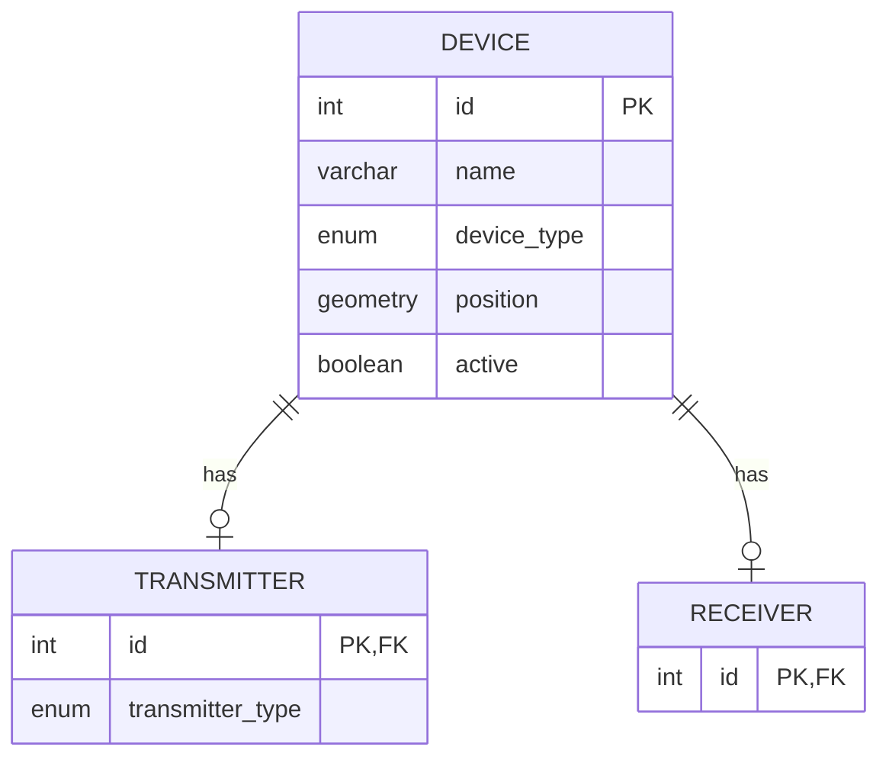

```markdown
# 資料庫結構 (Database Schema)

## 枚舉類型 (Enum Types)

為了更清晰地表示特定欄位的可能值，我們定義了以下 PostgreSQL 枚舉類型：

1.  **`devicetype`**:
    * **可能值:** `'transmitter'`, `'receiver'`
    * **用途:** 用於 `device` 表中的 `device_type` 欄位。

2.  **`transmittertype`**:
    * **可能值:** `'signal'`, `'interferer'`
    * **用途:** 用於 `transmitter` 表中的 `transmitter_type` 欄位。

## 資料表 (Tables)

### 1. `device` 表

儲存所有設備（發射器或接收器）的基礎通用資訊。

| 欄位名稱 (Column Name) | 資料類型 (Data Type)        | 描述/約束 (Description/Constraints)                                  |
| :--------------------- | :-------------------------- | :------------------------------------------------------------------- |
| `id`                   | `SERIAL`                    | 自動遞增的整數主鍵 (Primary Key)                                   |
| `name`                 | `VARCHAR`                   | 設備的唯一名稱 (Unique, Not Null)                                  |
| `device_type`          | `devicetype`                | 設備類型 (`'transmitter'` 或 `'receiver'`), (Not Null)               |
| `position`             | `GEOMETRY(PointZ, 4326)`    | 設備的 3D 座標 (使用 PostGIS 幾何類型, SRID 4326 - WGS 84)         |
| `active`               | `BOOLEAN`                   | 標示設備是否啟用 (Not Null, Default: `TRUE`)                         |

**索引 (Indexes):**

* `ix_device_name`: 針對 `name` 欄位的 B-tree 索引 (UNIQUE)。
* `ix_device_position`: 針對 `position` 欄位的 GIST 空間索引。
* `ix_device_active`: 針對 `active` 欄位的 B-tree 索引。

### 2. `transmitter` 表

儲存發射器特有的資訊，並關聯到 `device` 表。

| 欄位名稱 (Column Name) | 資料類型 (Data Type) | 描述/約束 (Description/Constraints)                                                                 |
| :--------------------- | :------------------- | :-------------------------------------------------------------------------------------------------- |
| `id`                   | `INTEGER`            | 主鍵 (Primary Key), 同時是外鍵 (Foreign Key) 引用 `device(id)`, `ON DELETE CASCADE`                   |
| `transmitter_type`     | `transmittertype`    | 發射器類型 (`'signal'` 或 `'interferer'`), (Not Null, Default: `'signal'`)                             |

### 3. `receiver` 表

儲存接收器特有的資訊（目前無額外欄位），並關聯到 `device` 表。

| 欄位名稱 (Column Name) | 資料類型 (Data Type) | 描述/約束 (Description/Constraints)                                           |
| :--------------------- | :------------------- | :---------------------------------------------------------------------------- |
| `id`                   | `INTEGER`            | 主鍵 (Primary Key), 同時是外鍵 (Foreign Key) 引用 `device(id)`, `ON DELETE CASCADE` |

---

## 📝 關聯圖 (Relationship)

